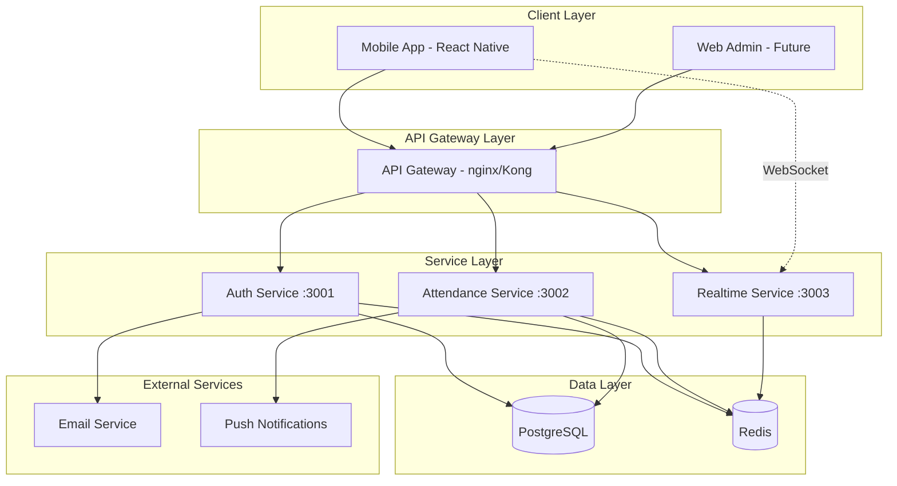

# System Architecture

## Overview
The GPS Attendance Tracking System follows a microservices architecture pattern with three core services.

## Architecture Diagram



## Services Description

### 1. Authentication Service (Port 3001)
**Responsibilities:**
- User registration and login
- JWT token management with refresh rotation
- Password reset and email verification
- Profile management
- Session management
- Account security (2FA, account locking)

**Key Technologies:**
- Express.js with TypeScript
- Prisma ORM for database
- Redis for session storage
- Nodemailer for emails
- Bcrypt for password hashing

### 2. Attendance Service (Port 3002)
**Responsibilities:**
- Course CRUD operations
- Session management
- GPS verification logic
- Attendance marking and validation
- Analytics and reporting
- Invitation system

**Key Features:**
- Haversine formula for distance calculation
- Time-based constraints
- Course invitation codes
- Attendance statistics

### 3. Realtime Service (Port 3003)
**Responsibilities:**
- WebSocket connections
- Real-time attendance updates
- Live session broadcasting
- Presence management
- Event distribution

**Implementation:**
- Socket.io for WebSocket
- Redis Pub/Sub for scaling
- Room-based architecture
- Event-driven updates

## Database Schema

### Core Models
1. **User** - Authentication and profile
2. **Course** - Course information
3. **CourseMember** - User-Course relationship
4. **Session** - Attendance sessions
5. **Attendance** - Attendance records
6. **RefreshToken** - Token management

### Relationships
- User -> Many Courses (as owner)
- User -> Many CourseMembers (as participant)
- Course -> Many Sessions
- Session -> Many Attendances
- User -> Many RefreshTokens

## Security Architecture

### Authentication Flow
1. User login with credentials
2. Server validates and generates JWT + Refresh token
3. Client stores tokens securely
4. Client sends JWT with requests
5. Server validates JWT on each request
6. Token refresh when JWT expires

### Security Measures
- JWT with short expiration (15 min)
- Refresh token rotation
- Rate limiting per endpoint
- Account lockout after failed attempts
- Email verification
- Input validation with Joi
- SQL injection prevention (Prisma)
- XSS protection (Helmet)
- CORS configuration

## Mobile App Architecture

### Navigation Structure
```
Root Navigator
├── Auth Stack (Unauthenticated)
│   ├── Splash
│   ├── Welcome
│   ├── SignIn
│   └── SignUp
└── Main Stack (Authenticated)
    ├── Tab Navigator
    │   ├── Home
    │   ├── Courses
    │   ├── Sessions
    │   └── Profile
    └── Modal Screens
        ├── Create Course
        ├── Join Course
        └── Mark Attendance
```

### State Management
- Redux Toolkit for global state
- Redux Persist for offline support
- Local component state for UI
- Context API for theme

### Data Flow
1. User action triggers Redux action
2. API call via Axios interceptor
3. Response updates Redux store
4. Components re-render with new data
5. Optimistic updates for better UX

## GPS Verification System

### Algorithm
```javascript
function verifyAttendance(userLocation, sessionLocation, radius) {
  const distance = haversineDistance(
    userLocation.lat,
    userLocation.lon,
    sessionLocation.lat,
    sessionLocation.lon
  );
  return distance <= radius;
}
```

### Constraints
- Default radius: 50 meters
- Configurable per session
- Location accuracy validation
- Time window verification
- Network latency consideration

## Scalability Considerations

### Horizontal Scaling
- Stateless services
- Redis for shared state
- Load balancer ready
- Database connection pooling

### Performance Optimization
- Database indexing
- Redis caching
- Pagination for lists
- Lazy loading
- Image optimization
- Code splitting

### Monitoring Points
- API response times
- Database query performance
- WebSocket connections
- Error rates
- User session metrics