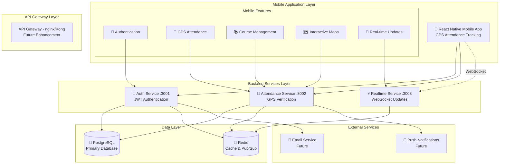

# System Architecture

## Overview
The GPS Attendance Tracking System follows a microservices architecture with a complete mobile application. The system consists of three backend services and a full-featured React Native mobile app.

## Complete System Architecture



## Component Status

### ✅ Completed Components
- **Mobile App** - Complete React Native application
- **Auth Service** - JWT authentication service
- **Attendance Service** - GPS-based attendance tracking
- **Realtime Service** - WebSocket real-time updates
- **Database Layer** - PostgreSQL with Redis caching

### 📋 Future Enhancements
- **API Gateway** - nginx/Kong for request routing
- **Web Admin Panel** - Administrative dashboard
- **Push Notifications** - Mobile notifications
- **Email Service** - Automated email notifications

## Services Description

### 1. Authentication Service (Port 3001)
**Responsibilities:**
- User registration and login
- JWT token management with refresh rotation
- Password reset and email verification
- Profile management
- Session management
- Account security (2FA, account locking)

**Key Technologies:**
- Express.js with TypeScript
- Prisma ORM for database
- Redis for session storage
- Nodemailer for emails
- Bcrypt for password hashing

### 2. Attendance Service (Port 3002)
**Responsibilities:**
- Course CRUD operations
- Session management
- GPS verification logic
- Attendance marking and validation
- Analytics and reporting
- Invitation system

**Key Features:**
- Haversine formula for distance calculation
- Time-based constraints
- Course invitation codes
- Attendance statistics

### 3. Realtime Service (Port 3003)
**Responsibilities:**
- WebSocket connections
- Real-time attendance updates
- Live session broadcasting
- Presence management
- Event distribution

**Implementation:**
- Socket.io for WebSocket
- Redis Pub/Sub for scaling
- Room-based architecture
- Event-driven updates

## Database Schema

### Core Models
1. **User** - Authentication and profile
2. **Course** - Course information
3. **CourseMember** - User-Course relationship
4. **Session** - Attendance sessions
5. **Attendance** - Attendance records
6. **RefreshToken** - Token management

### Relationships
- User -> Many Courses (as owner)
- User -> Many CourseMembers (as participant)
- Course -> Many Sessions
- Session -> Many Attendances
- User -> Many RefreshTokens

## Security Architecture

### Authentication Flow
1. User login with credentials
2. Server validates and generates JWT + Refresh token
3. Client stores tokens securely
4. Client sends JWT with requests
5. Server validates JWT on each request
6. Token refresh when JWT expires

### Security Measures
- JWT with short expiration (15 min)
- Refresh token rotation
- Rate limiting per endpoint
- Account lockout after failed attempts
- Email verification
- Input validation with Joi
- SQL injection prevention (Prisma)
- XSS protection (Helmet)
- CORS configuration

## Mobile App Architecture (COMPLETE)

### Complete Navigation Structure
```
Root Navigator (RootNavigator.tsx)
├── Loading Screen (App initialization)
├── Auth Stack (AuthNavigator.tsx) - Unauthenticated users
│   ├── Welcome Screen (Feature showcase)
│   ├── Login Screen (JWT authentication)
│   └── Register Screen (Role-based registration)
└── Main Stack (MainNavigator.tsx) - Authenticated users
    ├── Bottom Tab Navigator
    │   ├── Home Tab (Dashboard with real-time data)
    │   ├── Courses Tab (Course Stack Navigator)
    │   │   ├── Course List (Search, filter, browse)
    │   │   └── Join Course (QR scan, manual entry)
    │   ├── Attendance Tab (Attendance Stack Navigator)
    │   │   ├── Active Sessions (Session list)
    │   │   └── Mark Attendance (GPS tracking screen)
    │   └── Profile Tab (User management)
    └── Modal/Stack Screens
        ├── Course Details
        ├── Session Management
        └── Settings
```

### Complete State Management
- **Redux Toolkit** - Global state management with slices:
  - `authSlice` - Authentication state and JWT tokens
  - `courseSlice` - Course data and operations
  - `attendanceSlice` - Attendance records and GPS data
  - `sessionSlice` - Active sessions and real-time updates
- **Redux Persist** - Offline support and state persistence
- **Custom Hooks** - Type-safe Redux hooks (useAppDispatch, useAppSelector)
- **AsyncStorage** - Local data storage for tokens and preferences

### Mobile-Specific Features
- **GPS Tracking** - Real-time location monitoring with Expo Location
- **Maps Integration** - Interactive maps with session visualization
- **QR Code Scanning** - Camera-based course enrollment
- **Push Notifications** - Real-time attendance updates
- **Offline Support** - Cached data and Redux persistence
- **Professional UI** - Material Design 3 with gradient themes

### Data Flow Architecture
```
User Action → Redux Action → API Service → Backend → Database
     ↓              ↓            ↓          ↓         ↓
Component ← Redux Store ← Response ← Service ← Database Update
     ↓
UI Update (Real-time via WebSocket)
```

1. **User Interaction** - Touch events on mobile screens
2. **Redux Actions** - Dispatched to appropriate slice
3. **API Calls** - Service layer handles HTTP requests
4. **Backend Processing** - Microservices process requests
5. **Database Updates** - PostgreSQL with Prisma ORM
6. **Real-time Updates** - WebSocket broadcasts changes
7. **UI Updates** - Components re-render with new state

## GPS Verification System

### Algorithm
```javascript
function verifyAttendance(userLocation, sessionLocation, radius) {
  const distance = haversineDistance(
    userLocation.lat,
    userLocation.lon,
    sessionLocation.lat,
    sessionLocation.lon
  );
  return distance <= radius;
}
```

### Constraints
- Default radius: 50 meters
- Configurable per session
- Location accuracy validation
- Time window verification
- Network latency consideration

## Scalability Considerations

### Horizontal Scaling
- Stateless services
- Redis for shared state
- Load balancer ready
- Database connection pooling

### Performance Optimization
- Database indexing
- Redis caching
- Pagination for lists
- Lazy loading
- Image optimization
- Code splitting

### Monitoring Points
- API response times
- Database query performance
- WebSocket connections
- Error rates
- User session metrics