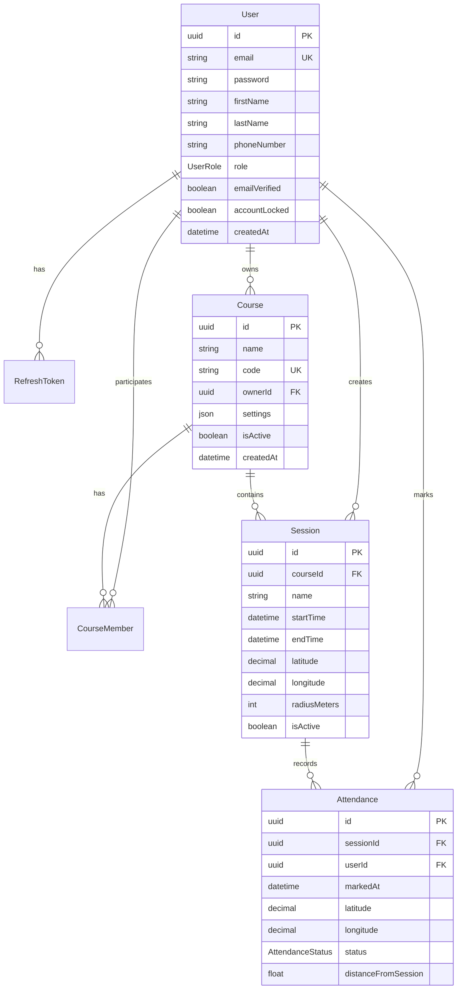

# Database Documentation

## Database Schema Overview

The attendance tracking system uses PostgreSQL as the primary database with Prisma ORM for type-safe database access.

## Entity Relationship Diagram



## Tables Description

### Users Table
Stores all user information including authentication details and profile data.

**Key Fields:**
- `id`: UUID primary key
- `email`: Unique email address
- `password`: Bcrypt hashed password
- `role`: ADMIN, INSTRUCTOR, or STUDENT
- `emailVerified`: Email verification status
- `accountLocked`: Security feature for failed login attempts

**Security Features:**
- Password hashing with bcrypt (10 rounds)
- Account locking after 5 failed attempts
- Email verification tokens
- Password reset tokens with expiry

### Courses Table
Contains course information and settings.

**Settings JSON Structure:**
```json
{
  "gpsRadius": 50,
  "allowLateEntry": true,
  "lateEntryMinutes": 15,
  "requireSelfie": false,
  "autoEndSession": true,
  "autoEndMinutes": 120
}
```

### Sessions Table
Represents individual attendance sessions within a course.

**Key Features:**
- GPS coordinates for location verification
- Configurable radius for attendance marking
- Time-based constraints
- Optional QR code and access code

### Attendance Table
Records individual attendance marks with verification data.

**Tracking Information:**
- Exact GPS coordinates
- Distance from session location
- Device information
- IP address for security
- Optional selfie verification

## Indexes

### Performance Indexes
```sql
-- User lookups
CREATE INDEX idx_users_email ON users(email);
CREATE INDEX idx_users_email_verification_token ON users(email_verification_token);
CREATE INDEX idx_users_password_reset_token ON users(password_reset_token);

-- Token lookups
CREATE INDEX idx_refresh_tokens_token ON refresh_tokens(token);
CREATE INDEX idx_refresh_tokens_user_id ON refresh_tokens(user_id);

-- Course queries
CREATE INDEX idx_courses_code ON courses(code);
CREATE INDEX idx_courses_owner_id ON courses(owner_id);
CREATE INDEX idx_courses_is_active ON courses(is_active);

-- Session queries
CREATE INDEX idx_sessions_course_id ON sessions(course_id);
CREATE INDEX idx_sessions_is_active ON sessions(is_active);
CREATE INDEX idx_sessions_start_time ON sessions(start_time);

-- Attendance queries
CREATE INDEX idx_attendances_session_id ON attendances(session_id);
CREATE INDEX idx_attendances_user_id ON attendances(user_id);
CREATE INDEX idx_attendances_status ON attendances(status);
```

## Constraints

### Unique Constraints
- `users.email`: Ensures unique email addresses
- `courses.code`: Ensures unique course codes
- `[course_members.course_id, course_members.user_id]`: Prevents duplicate enrollments
- `[attendances.session_id, attendances.user_id]`: Prevents duplicate attendance marks

### Foreign Key Constraints
All foreign keys have `ON DELETE CASCADE` to maintain referential integrity.

## Data Types

### Custom Enums
```typescript
enum UserRole {
  ADMIN = 'ADMIN',
  INSTRUCTOR = 'INSTRUCTOR',
  STUDENT = 'STUDENT'
}

enum CourseRole {
  OWNER = 'OWNER',
  PARTICIPANT = 'PARTICIPANT'
}

enum AttendanceStatus {
  PRESENT = 'PRESENT',
  LATE = 'LATE',
  ABSENT = 'ABSENT'
}
```

### JSON Fields
- `courses.settings`: Course configuration
- `attendances.device_info`: Device metadata
- `system_logs.metadata`: Audit log data

## Migrations

### Running Migrations
```bash
# Development
npx prisma migrate dev

# Production
npx prisma migrate deploy

# Create migration without applying
npx prisma migrate dev --create-only

# Reset database
npx prisma migrate reset
```

### Migration History
Track all migrations in `prisma/migrations/` directory.

## Backup Strategy

### Automated Backups
```bash
# Daily backup script
#!/bin/bash
pg_dump $DATABASE_URL > backup_$(date +%Y%m%d).sql
```

### Point-in-Time Recovery
Configure PostgreSQL WAL archiving for PITR capability.

## Performance Optimization

### Query Optimization
1. Use select specific fields instead of SELECT *
2. Implement pagination for large datasets
3. Use database connection pooling
4. Cache frequently accessed data in Redis

### Connection Pooling
```typescript
const prisma = new PrismaClient({
  datasources: {
    db: {
      url: process.env.DATABASE_URL,
    },
  },
  connection_limit: 10,
});
```

## Monitoring

### Key Metrics
- Connection pool usage
- Query execution time
- Slow query log
- Table sizes
- Index usage

### Health Checks
```typescript
async function checkDatabaseHealth() {
  try {
    await prisma.$queryRaw`SELECT 1`;
    return { status: 'healthy' };
  } catch (error) {
    return { status: 'unhealthy', error };
  }
}
```

## Security Best Practices

1. **Data Encryption**
   - Use SSL/TLS for connections
   - Encrypt sensitive fields at rest
   
2. **Access Control**
   - Use connection pooling with limited permissions
   - Implement row-level security where needed
   
3. **Audit Logging**
   - Log all data modifications
   - Track failed authentication attempts
   
4. **Data Sanitization**
   - Use parameterized queries (handled by Prisma)
   - Validate input before database operations

## Maintenance

### Regular Tasks
- Weekly: Analyze and vacuum tables
- Monthly: Review slow query logs
- Quarterly: Review and update indexes
- Yearly: Archive old attendance data

### Commands
```sql
-- Analyze tables
ANALYZE;

-- Vacuum to reclaim space
VACUUM FULL;

-- Check table sizes
SELECT schemaname, tablename, pg_size_pretty(pg_total_relation_size(schemaname||'.'||tablename)) 
FROM pg_tables WHERE schemaname = 'public';

-- Check index usage
SELECT schemaname, tablename, indexname, idx_scan 
FROM pg_stat_user_indexes ORDER BY idx_scan;
```