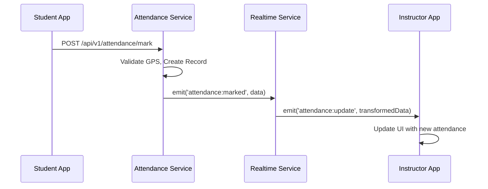
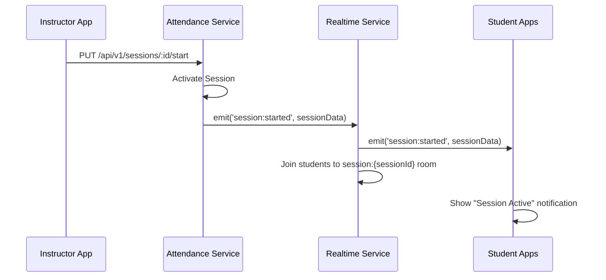
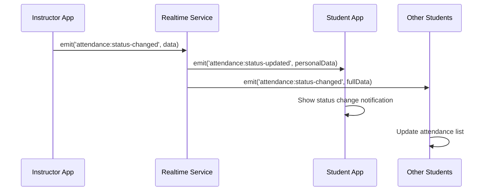

# Realtime Service Event Reference

**Last Updated:** 2025-08-27 17:31:46 UTC  
**Author:** borakport

## 📋 Event Categories

### 🎓 Course Events

#### `course:created`
**Emitted by:** Attendance Service → Realtime Service  
**Received by:** Course owner  
**Purpose:** Notify when a new course is created

```json
{
  "courseId": "uuid",
  "ownerId": "uuid",
  "courseName": "string",
  "courseCode": "string",
  "createdAt": "ISO8601"
}
```

#### `course:joined`
**Emitted by:** Attendance Service → Realtime Service  
**Received by:** All course members  
**Purpose:** Notify when someone joins a course

```json
{
  "courseId": "uuid",
  "userId": "uuid",
  "userName": "string",
  "userEmail": "string",
  "joinedAt": "ISO8601"
}
```

#### `course:left`
**Emitted by:** Attendance Service → Realtime Service  
**Received by:** All remaining course members  
**Purpose:** Notify when someone leaves a course

```json
{
  "courseId": "uuid",
  "userId": "uuid",
  "userName": "string",
  "leftAt": "ISO8601"
}
```

### 📚 Session Events

#### `session:created`
**Emitted by:** Attendance Service → Realtime Service  
**Received by:** All course members  
**Purpose:** Notify when a new session is scheduled

```json
{
  "sessionId": "uuid",
  "courseId": "uuid",
  "sessionName": "string",
  "instructorId": "uuid",
  "startTime": "ISO8601",
  "endTime": "ISO8601",
  "location": "string",
  "requireSelfie": "boolean",
  "allowLateEntry": "boolean",
  "lateMinutes": "number",
  "radiusMeters": "number"
}
```

#### `session:started`
**Emitted by:** Attendance Service → Realtime Service  
**Received by:** All course members  
**Purpose:** Notify when a session becomes active

```json
{
  "sessionId": "uuid",
  "courseId": "uuid",
  "sessionName": "string",
  "memberIds": ["uuid"],
  "startedAt": "ISO8601",
  "latitude": "number",
  "longitude": "number",
  "radiusMeters": "number"
}
```

#### `session:ended`
**Emitted by:** Attendance Service → Realtime Service  
**Received by:** All session participants  
**Purpose:** Notify when a session is closed with final stats

```json
{
  "sessionId": "uuid",
  "courseId": "uuid",
  "endedAt": "ISO8601",
  "stats": {
    "totalStudents": "number",
    "presentCount": "number",
    "lateCount": "number",
    "absentCount": "number",
    "attendanceRate": "number"
  }
}
```

### ✅ Attendance Events

#### `attendance:marked`
**Emitted by:** Attendance Service → Realtime Service  
**Received by:** Session monitors (instructors/admins)  
**Purpose:** Real-time notification when student marks attendance

```json
{
  "sessionId": "uuid",
  "attendanceId": "uuid",
  "userId": "uuid",
  "status": "PRESENT|LATE|ABSENT"
}
```

**Transformed to `attendance:update` for clients:**
```json
{
  "sessionId": "uuid",
  "userId": "uuid",
  "userName": "string",
  "status": "PRESENT|LATE|ABSENT",
  "markedAt": "ISO8601",
  "type": "marked"
}
```

#### `attendance:bulk-update`
**Emitted by:** Client → Realtime Service  
**Received by:** All session participants  
**Purpose:** Handle bulk attendance modifications by instructor

```json
{
  "sessionId": "uuid",
  "updates": [
    {
      "userId": "uuid",
      "status": "PRESENT|LATE|ABSENT",
      "notes": "string"
    }
  ],
  "updatedBy": "uuid",
  "updatedAt": "ISO8601"
}
```

#### `attendance:status-changed`
**Emitted by:** Client → Realtime Service  
**Received by:** Affected user + session monitors  
**Purpose:** Notify when instructor changes a student's attendance status

```json
{
  "sessionId": "uuid",
  "userId": "uuid",
  "oldStatus": "PRESENT|LATE|ABSENT",
  "newStatus": "PRESENT|LATE|ABSENT",
  "notes": "string",
  "changedBy": "uuid",
  "changedAt": "ISO8601"
}
```

**Transformed to `attendance:status-updated` for affected user:**
```json
{
  "sessionId": "uuid",
  "status": "PRESENT|LATE|ABSENT",
  "notes": "string"
}
```

#### `attendance:late-entry`
**Emitted by:** Client → Realtime Service  
**Received by:** Session monitors  
**Purpose:** Special notification for late attendance attempts

```json
{
  "sessionId": "uuid",
  "userId": "uuid",
  "userName": "string",
  "attemptedAt": "ISO8601",
  "minutesLate": "number",
  "allowed": "boolean",
  "reason": "string"
}
```

## 🏠 Room Management

### Room Types and Membership

#### User Rooms: `user:{userId}`
**Purpose:** Personal notifications  
**Members:** Individual user  
**Events:**
- `course:created` (when user creates course)
- `attendance:status-updated` (when their status changes)

#### Course Rooms: `course:{courseId}`
**Purpose:** Course-wide broadcasts  
**Members:** All enrolled students + instructors  
**Events:**
- `course:joined` / `course:left`
- `session:created`
- `session:started`

#### Session Rooms: `session:{sessionId}`
**Purpose:** Active session monitoring  
**Members:** Session participants + instructors  
**Events:**
- `attendance:update`
- `attendance:bulk-update`
- `attendance:status-changed`
- `attendance:late-entry`
- `session:ended`

#### Instructor Rooms: `instructor:{userId}`
**Purpose:** Instructor-specific notifications  
**Members:** Individual instructor  
**Events:**
- Advanced session analytics
- System notifications
- Course management alerts

## 🔄 Event Flow Examples

### Example 1: Student Marks Attendance


### Example 2: Session Start Flow


### Example 3: Instructor Changes Student Status


## 🎯 Client Implementation Examples

### React Web Client
```javascript
import io from 'socket.io-client';

class RealtimeService {
  constructor() {
    this.socket = io('http://localhost:3003', {
      auth: { token: localStorage.getItem('authToken') }
    });

    this.setupEventListeners();
  }

  setupEventListeners() {
    // Course events
    this.socket.on('course:joined', this.handleCourseJoined.bind(this));
    
    // Session events
    this.socket.on('session:started', this.handleSessionStarted.bind(this));
    this.socket.on('session:ended', this.handleSessionEnded.bind(this));
    
    // Attendance events
    this.socket.on('attendance:update', this.handleAttendanceUpdate.bind(this));
    this.socket.on('attendance:status-updated', this.handleStatusUpdate.bind(this));
  }

  handleAttendanceUpdate(data) {
    // Update real-time attendance list
    console.log('New attendance:', data);
    this.updateAttendanceUI(data);
  }

  joinSessionRoom(sessionId) {
    this.socket.emit('join-room', `session:${sessionId}`);
  }
}
```

### React Native Mobile Client
```javascript
import io from 'socket.io-client';
import { Alert } from 'react-native';

class MobileRealtimeService {
  constructor() {
    this.socket = null;
  }

  async connect() {
    const token = await AsyncStorage.getItem('authToken');
    
    this.socket = io('http://192.168.1.100:3003', {
      auth: { token }
    });

    this.socket.on('session:started', (data) => {
      Alert.alert('Session Started', `${data.sessionName} is now active!`);
    });

    this.socket.on('attendance:status-updated', (data) => {
      Alert.alert('Attendance Updated', `Your status: ${data.status}`);
    });
  }

  markAttendance(sessionId, location) {
    // This would typically call the REST API
    // The realtime notification comes back automatically
    fetch('/api/v1/attendance/mark', {
      method: 'POST',
      body: JSON.stringify({
        sessionId,
        latitude: location.latitude,
        longitude: location.longitude
      })
    });
  }
}
```

## 🔧 Error Handling

### Connection Errors
```javascript
socket.on('connect_error', (error) => {
  console.error('Connection failed:', error.message);
  
  if (error.message === 'Authentication token required') {
    // Redirect to login
    window.location.href = '/login';
  }
});
```

### Event Error Responses
```javascript
socket.emit('join-session', { sessionId: 'invalid' }, (response) => {
  if (response.error) {
    console.error('Failed to join session:', response.error);
  }
});
```

## 📊 Event Analytics & Monitoring

### Event Frequency (Typical Session)
- `session:started`: 1 per session
- `attendance:marked`: 20-100 per session (depending on class size)
- `attendance:update`: 20-100 per session (broadcasts to instructors)
- `session:ended`: 1 per session

### Performance Considerations
- **High Frequency Events:** `attendance:marked` during session start
- **Memory Usage:** Session rooms with 100+ students
- **Network Traffic:** Real-time updates to multiple clients

### Monitoring Queries
```bash
# Redis monitoring for event flow
redis-cli monitor | grep attendance

# WebSocket connection count
curl http://localhost:3003/health

# Check active rooms
# (Requires admin endpoint - to be implemented)
```

---

**Note:** This event reference is designed to work with the current Socket.io implementation. For Redis pub/sub integration, event formats remain the same but transmission method changes from direct Socket.io emit to Redis publish/subscribe.
